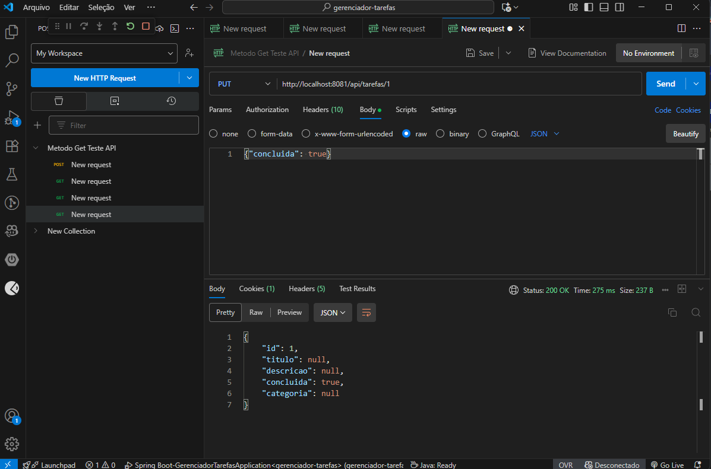

# Gerenciador de Tarefas Pessoais (API REST)

Uma API REST simples e completa para gerenciar tarefas, construída com **Spring Boot 3** e **Java 17**. Este projeto demonstra as operações **CRUD (Criação, Leitura, Atualização e Deleção)** e utiliza um banco de dados em memória para facilitar os testes.

## 🛠️ Tecnologias Utilizadas

Este projeto foi desenvolvi utilizando Java:

* **Linguagem:** Java 17
* **Framework:** Spring Boot 3.3.1 (Spring Framework 6)
* **Banco de Dados:** H2 Database (em memória, para desenvolvimento)
* **Acesso a Dados:** Spring Data JPA
* **Validação:** Jakarta Bean Validation
* **Documentação:** SpringDoc OpenAPI (Swagger UI) - Versão 2.1.0

## 🚀 Como Rodar o Projeto

### Pré-requisitos

* JDK 17 ou superior
* Maven

### 1. Clonar o Repositório

Use o comando `git clone` para copiar o projeto para sua máquina.

```bash
git clone [gh repo clone Gleysson369/Gerenciador-de-Tarefas-Pessoais](https://github.com/Gleysson369/Gerenciador-de-Tarefas-Pessoais.git)
cd gerenciador-tarefas
```

 ### 2. Executar o Spring Boot

Use o Maven para compilar e iniciar o projeto:

```
```Bash
./mvnw spring-boot:run
```
O servidor será iniciado na porta 8081.

## 📝 Documentação da API (Swagger UI)

A documentação interativa da API (Swagger) para testar todos os endpoints.
- URL da Documentação: http://localhost:8081/swagger-ui.html

____________________________________________________________________________

## 🔗 Endpoints da API

```Bash
Método	Endpoint	Descrição	Status de Sucesso
POST	/api/v1/tarefas	Cria uma nova tarefa.	201 Created 
GET	/api/v1/tarefas	Lista todas as tarefas cadastradas.	200 OK 
GET	/api/v1/tarefas/{id}	Busca uma tarefa específica por ID.	200 OK ou 404 Not Found 
PUT	/api/v1/tarefas/{id}	Atualiza todos os dados de uma tarefa existente.	200 OK ou 404 Not Found 
DELETE /api/v1/tarefas/{id}	Exclui uma tarefa por ID.	204 No Content ou 404 Not Found 
```

## 💡 Destaques de Programação (Atividade 3)

- Versionamento de API: Implementação da estratégia por URL (`/api/v1`) para compatibilidade e evolução futura.
- Arquitetura Escalável: Reestruturação do projeto com a adição da Camada de Serviço (`Service`) para separar a lógica de negócios do Controller (MVC aprimorado).
- Tratamento de Exceções: Implementação de `GlobalExceptionHandler` para personalizar respostas de erros e validações, retornando mensagens claras ao cliente.
- Validação de Dados: Uso de `@Valid` e Jakarta Bean Validation para garantir a integridade dos dados no momento da requisição.